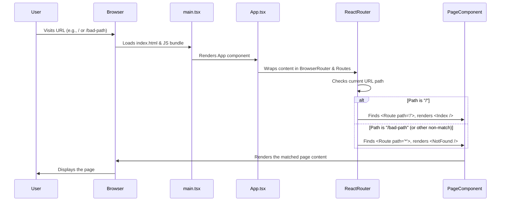

# Chapter 1: Application Entry & Routing

Welcome to the `ai-apple-web-forge` project! This is the very first step in understanding how this modern website is built. Think of building a website like constructing a building. Before you can decorate the rooms or decide what happens inside, you need a main entrance, a lobby, and a directory to guide visitors. That's exactly what this chapter is about!

**What's the Goal?**

Imagine you visit a website, like `www.example.com`. How does the browser know *what* content to show you? If you click a link to `www.example.com/about`, how does the content change to the "About Us" page without reloading everything?

This chapter explains the fundamental structure that makes this possible:

1.  **Starting the App:** How the website code first begins to run.
2.  **Setting the Stage:** Creating the overall layout and providing necessary tools (like helper services).
3.  **Navigation:** Deciding which "page" or view to display based on the web address (URL) you are visiting.

We'll use the analogy of a building:

*   `main.tsx`: The main entrance door. The very first point where visitors (your browser) enter the application.
*   `App.tsx`: The lobby and directory. It provides the overall structure, maybe some essential services (like information desks or power outlets – we call these "Providers"), and crucially, the map (`Routes`) telling you where each room is.
*   `Index.tsx` / `NotFound.tsx`: Specific rooms or destinations. `Index.tsx` is typically the main hall or homepage, while `NotFound.tsx` is the room you end up in if you try to go somewhere that doesn't exist.

Let's open the door and see how it works!

## The Entry Point: `main.tsx`

Every application needs a starting point. In our React project, that file is typically `src/main.tsx`. Its job is incredibly simple but vital: find the main placeholder in our HTML file and tell React to start rendering our application inside it.

```typescript
// src/main.tsx

// Import the function needed to start our React app
import { createRoot } from 'react-dom/client';
// Import our main application component (the "lobby")
import App from './App.tsx';
// Import the main CSS file for basic styling
import './index.css';

// Find the HTML element with the id 'root' in index.html
const rootElement = document.getElementById("root")!;

// Tell React to take control of that element and render our <App> component inside it
createRoot(rootElement).render(<App />);
```

**Explanation:**

1.  We import `createRoot` from `react-dom/client`, which is the modern way to start a React application in the browser.
2.  We import our `App` component (defined in `App.tsx`), which acts as the main container for everything else.
3.  We import `./index.css`, which contains global styles, often including setup for [Tailwind CSS Styling](03_tailwind_css_styling_.md).
4.  `document.getElementById("root")` finds a specific `<div>` tag in our main `index.html` file (usually `<div id="root"></div>`). This is where our entire React application will live.
5.  `createRoot(...).render(<App />)` initializes React and tells it to draw the `App` component (and everything inside it) onto the web page within that `<div id="root">`.

Think of `main.tsx` as the construction worker who finds the designated plot of land (`<div id="root">`) and places the foundation (`<App />`) of our building onto it.

## The Lobby and Directory: `App.tsx`

Now that React has started rendering `<App />`, let's look inside `src/App.tsx`. This file acts as the central hub or lobby of our website.

```typescript
// src/App.tsx

// Import components for showing notifications (Toasts/Sonner)
import { Toaster } from "@/components/ui/toaster";
import { Toaster as Sonner } from "@/components/ui/sonner";
// Import provider for nice tooltips on hover
import { TooltipProvider } from "@/components/ui/tooltip";
// Import things for managing data fetching
import { QueryClient, QueryClientProvider } from "@tanstack/react-query";
// Import tools from React Router for navigation
import { BrowserRouter, Routes, Route } from "react-router-dom";

// Import our actual page components
import Index from "./pages/Index"; // The homepage
import NotFound from "./pages/NotFound"; // The "404 Not Found" page

// Create a client for managing data fetching (details not important now)
const queryClient = new QueryClient();

// Define the main App component
const App = () => (
  // Provider for data fetching
  <QueryClientProvider client={queryClient}>
    {/* Provider for tooltips */}
    <TooltipProvider>
      {/* Components to show notifications */}
      <Toaster />
      <Sonner />

      {/* This enables website navigation */}
      <BrowserRouter>
        {/* This holds all the different page routes */}
        <Routes>
          {/* Route 1: If the URL path is exactly "/", show the Index page */}
          <Route path="/" element={<Index />} />

          {/* ADD ALL CUSTOM ROUTES ABOVE THE CATCH-ALL "*" ROUTE */}
          {/* Example: <Route path="/about" element={<AboutPage />} /> */}

          {/* Catch-all Route: If no other path matches, show the NotFound page */}
          <Route path="*" element={<NotFound />} />
        </Routes>
      </BrowserRouter>
    </TooltipProvider>
  </QueryClientProvider>
);

export default App;
```

**Explanation:**

*   **Providers:** Notice how the entire content is wrapped in components like `<QueryClientProvider>`, `<TooltipProvider>`, `<BrowserRouter>`. These are called "Providers". They don't usually display anything directly, but they provide capabilities or context to all the components inside them.
    *   `QueryClientProvider`: Helps with fetching and managing data from servers.
    *   `TooltipProvider`: Enables interactive tooltips, often used with components from [shadcn-ui Component Library](04_shadcn_ui_component_library_.md).
    *   `BrowserRouter`: This is the core of our navigation! It connects our app to the browser's address bar URL.
*   **`BrowserRouter`:** This component enables "routing". It watches the browser's address bar.
*   **`Routes`:** This component acts like a switchboard. It looks at the current URL provided by `BrowserRouter`.
*   **`Route`:** Each `<Route>` component defines a rule:
    *   `path="/"`: If the URL path is exactly `/` (like `www.example.com`), render the component specified in the `element` prop.
    *   `element={<Index />}`: So, for the homepage (`/`), we show the `Index` component (our main landing page).
    *   `path="*"`: The asterisk `*` is a wildcard. It matches *any* URL path that wasn't matched by the routes above it.
    *   `element={<NotFound />}`: If someone visits `www.example.com/some-page-that-doesnt-exist`, the `*` route catches it, and we show the `NotFound` component.

Think of `App.tsx` as the lobby. It has essential services available (the Providers) and a big directory (`<Routes>`) managed by the `BrowserRouter`. When you enter a destination (URL path), the directory tells you exactly which room (`<Route element={...} />`) to go to.

## The Rooms: Page Components (`Index.tsx`, `NotFound.tsx`)

These are the actual "pages" or views that the user sees.

**`src/pages/Index.tsx` (Simplified View)**

```typescript
// src/pages/Index.tsx
import React from 'react';
// ... other imports for layout, animation, etc.

// This is the component shown for the "/" path
const Index = () => {
  return (
    <div className="min-h-screen flex flex-col">
      {/* Header, Hero section, Showcases, etc. would go here */}
      <h1>Welcome to the Homepage!</h1>
      {/* This page content is built using components like those described in
         [Custom Page Components](02_custom_page_components_.md) */}
    </div>
  );
};

export default Index;
```

**Explanation:**

*   This is a standard React component.
*   It defines the structure and content for the homepage.
*   In the real `Index.tsx`, it imports and arranges various smaller components (like `Header`, `Hero`) to build the complete page, often styled using [Tailwind CSS Styling](03_tailwind_css_styling_.md) and potentially animated with [Animation (Framer Motion)](06_animation__framer_motion_.md).

**`src/pages/NotFound.tsx`**

```typescript
// src/pages/NotFound.tsx
import { useLocation } from "react-router-dom"; // Hook to get URL info
import { useEffect } from "react"; // Hook for side effects

// This component is shown when no other route matches
const NotFound = () => {
  const location = useLocation(); // Get current URL details

  // Log an error when this page loads (optional)
  useEffect(() => {
    console.error(
      "404 Error: User tried path:",
      location.pathname // Log the specific path they tried
    );
  }, [location.pathname]);

  return (
    <div className="min-h-screen flex items-center justify-center">
      <div className="text-center">
        <h1 className="text-4xl font-bold mb-4">404</h1>
        <p className="text-xl mb-4">Oops! Page not found</p>
        {/* Link back to the homepage */}
        <a href="/" className="text-blue-500 underline">
          Return to Home
        </a>
      </div>
    </div>
  );
};

export default NotFound;
```

**Explanation:**

*   This component displays a standard "404 Not Found" message.
*   It uses `useLocation` from React Router to get information about the URL that led here.
*   The `useEffect` hook is used here to log an error to the browser's console, which can be helpful for debugging.
*   It provides a link back to the homepage (`/`).

## How it All Connects: Under the Hood

Let's trace the journey when you visit the homepage (`/`):

1.  **You type `www.yoursite.com` (which corresponds to `/`) into your browser.**
2.  **Browser:** Loads the `index.html` file. This file contains `<div id="root"></div>` and includes the JavaScript bundle created from our code.
3.  **`main.tsx`:** The included JavaScript starts running. `main.tsx` finds `<div id="root">` and tells React to render the `<App />` component into it.
4.  **`App.tsx`:** The `App` component starts rendering.
    *   It sets up the `QueryClientProvider`, `TooltipProvider`, etc.
    *   It renders `BrowserRouter`, which starts listening to the browser's URL (`/`).
    *   It renders `<Routes>`.
5.  **React Router (`BrowserRouter` & `<Routes>`):**
    *   Looks at the current path: `/`.
    *   Checks the defined `<Route>` components inside `<Routes>`.
    *   Finds `<Route path="/" element={<Index />} />`. It's a match!
6.  **`Index.tsx`:** React Router tells React to render the `<Index />` component.
7.  **Browser:** Displays the content generated by the `Index` component (the homepage).

Now, what if you visit `/about-us` (and we haven't defined a route for it)?

1.  Steps 1-4 are the same.
2.  **React Router (`BrowserRouter` & `<Routes>`):**
    *   Looks at the current path: `/about-us`.
    *   Checks `<Route path="/" ... />`. No match.
    *   *(Checks any other custom routes we might have added)*. Assume no match.
    *   Checks `<Route path="*" element={<NotFound />} />`. The `*` matches anything not previously matched. It's a match!
3.  **`NotFound.tsx`:** React Router tells React to render the `<NotFound />` component.
4.  **Browser:** Displays the "404 Oops! Page not found" message.

Here's a simplified diagram of this flow:



This system allows us to create a Single Page Application (SPA). The main HTML page (`index.html`) is loaded only once. When you navigate between pages (e.g., from `/` to `/about`), React Router intercepts the navigation, updates the URL in the address bar (using browser history APIs), and swaps out the displayed page component (`Index` for `AboutPage`) *without* requesting a whole new page from the server. This makes navigation feel much faster and smoother.

## Conclusion

Congratulations! You've just learned about the fundamental structure of our web application. You now understand:

*   How the application starts with `main.tsx`.
*   How `App.tsx` acts as the central hub, setting up essential **Providers** and defining the website's **navigation structure** using React Router (`BrowserRouter`, `Routes`, `Route`).
*   How different **Page Components** (`Index.tsx`, `NotFound.tsx`) are displayed based on the URL path.
*   How this **routing** system allows for smooth navigation within a Single Page Application.

This structure forms the backbone of our website. With this foundation in place, we can now start building the actual content and features of our pages.

In the next chapter, we'll look closer at how pages like `Index.tsx` are built by combining smaller, reusable pieces of UI.

Ready to build some pages? Let's move on to [Chapter 2: Custom Page Components](02_custom_page_components_.md)!

---

Generated by [AI Codebase Knowledge Builder](https://github.com/The-Pocket/Tutorial-Codebase-Knowledge)