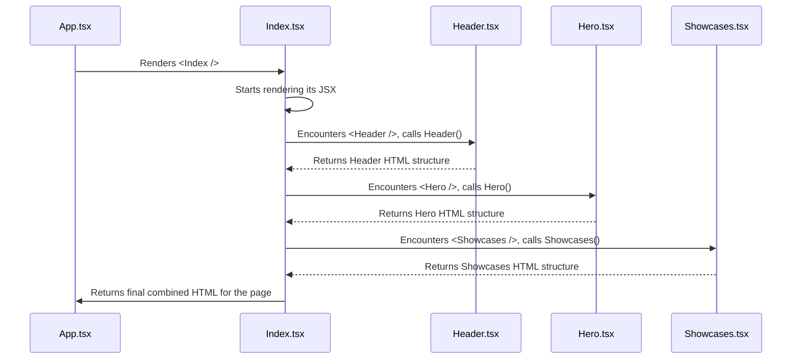

# Chapter 2: Custom Page Components

Welcome back! In [Chapter 1: Application Entry & Routing](01_application_entry___routing_.md), we learned how our website application starts up and how it uses React Router to decide which main page component (like `Index.tsx` or `NotFound.tsx`) to display based on the web address. We set up the "lobby" and the "directory" for our digital building.

Now, let's peek inside one of those main rooms, specifically the homepage (`Index.tsx`). How is the actual *content* of that page built? It's not just one giant block of code! Instead, it's constructed using smaller, dedicated pieces.

**What's the Goal?**

Imagine you're building a detailed model house. You wouldn't carve the whole thing from one block of wood. You'd build the walls, the roof, the doors, and the windows as separate pieces and then assemble them.

Similarly, complex web pages are built by combining smaller, focused UI elements. This chapter introduces the main building blocks used *specifically* for the content and layout of our site's pages. We call these **Custom Page Components**.

Think of our homepage (`Index.tsx`) as a museum's main exhibit hall. This hall isn't empty; it's filled with specific display areas:

*   A grand entrance area (the `Hero` section).
*   Display cases showing off cool projects (the `Showcases` section).
*   An information booth explaining services (the `WhatWeDo` section).
*   A sign pointing towards the exit or next steps (the `CallToAction` section).
*   A banner running across the top (the `Header`).

Each of these "display areas" is a **Custom Page Component**.

## What are Custom Page Components?

These are React components specifically designed to represent significant sections or features of *our* website's pages. They bundle together:

1.  **Structure:** Using HTML tags (like `<div>`, `<h1>`, ``, `<p>`).
2.  **Content:** Text, images, maybe videos.
3.  **Smaller UI Pieces:** Often incorporating ready-made elements from libraries like [shadcn-ui Component Library](04_shadcn_ui_component_library_.md) (e.g., buttons, cards).
4.  **Styling:** Using techniques like [Tailwind CSS Styling](03_tailwind_css_styling_.md) and sometimes CSS Modules to control the look and feel (colors, spacing, layout).

In our project, components like `Header.tsx`, `Hero.tsx`, `Showcases.tsx`, `WhatWeDo.tsx`, and `CallToAction.tsx` (located in the `src/components/` directory) are prime examples. They are the custom-built furniture and exhibits that make our website unique.

## How Are They Used? Building the Homepage

Let's look at how our main page component, `Index.tsx`, uses these custom components to assemble the homepage.

```typescript
// src/pages/Index.tsx

// Import React and other tools (like for animation)
import React from 'react';
import { motion } from 'framer-motion';

// Import our custom page components!
import Header from '../components/Header';     // The top navigation bar
import Hero from '../components/Hero';         // The main welcome area
import Showcases from '../components/Showcases'; // Project display section
import CallToAction from '../components/CallToAction'; // The "Get in Touch" section
import WhatWeDo from '../components/WhatWeDo';     // Explains services
import CustomCursor from '../components/CustomCursor'; // A cool visual effect

const Index = () => {
  // ... (code to handle mobile cursor omitted for simplicity)

  return (
    // A container div, often styled using Tailwind
    <motion.div 
      className="min-h-screen flex flex-col"
      // ... (animation props omitted)
    >
      {/* Use the CustomCursor component (if not mobile) */}
      <CustomCursor /> 
      
      {/* Use the Header component */}
      <Header /> 

      {/* The main content area */}
      <main>
        {/* Use the Hero component */}
        <Hero /> 

        {/* Use the Showcases component */}
        <Showcases /> 

        {/* Use the WhatWeDo component */}
        <WhatWeDo /> 

        {/* Use the CallToAction component */}
        <CallToAction /> 
      </main>
    </motion.div>
  );
};

export default Index; // Make this component available for App.tsx
```

**Explanation:**

1.  **Import:** We first `import` each custom page component we need (e.g., `import Hero from '../components/Hero';`). This tells our `Index.tsx` file where to find the code for each section.
2.  **Use:** Inside the `return (...)` block (which defines what the `Index` component looks like), we simply use the imported components like custom HTML tags: `<Header />`, `<Hero />`, `<Showcases />`, etc.
3.  **Assembly:** React takes care of rendering the content defined within each of these custom components in the order we've placed them.

Think of it like a recipe: `Index.tsx` is the main recipe card. It lists the major steps (ingredients/components): "First, add the Header. Then, add the Hero section. Next, add the Showcases..." Each imported component (`Header.tsx`, `Hero.tsx`) contains the detailed instructions for making *that specific part* of the dish.

This approach keeps the main `Index.tsx` file clean and focused on the overall structure of the page, rather than getting lost in the details of each section.

## Peeking Inside a Component: `Hero.tsx`

Let's look at a simplified version of one of these components, `Hero.tsx`, to understand its basic structure.

```typescript
// src/components/Hero.tsx

import React from 'react';
// Import styles specifically for this component
import styles from './Hero.module.css'; 

const Hero = () => {
  return (
    // The main container for the hero section
    // Uses a CSS class from the imported styles file
    <div className={styles.hero}> 
      {/* Background image (styled via CSS) */}
      
      {/* Container for the text content */}
      <div className={styles.heroContent}> 
        {/* Main title */}
        <h1 className={styles.heroTitle}>Nodera</h1> 
        {/* Subtitle */}
        <h2 className={styles.heroSubtitle}>Web Studio</h2> 
      </div>
    </div>
  );
};

export default Hero; // Make the Hero component usable by other files
```

**Explanation:**

*   **Standard Component:** It's a standard React function component (`const Hero = () => { ... };`).
*   **JSX Return:** It returns JSX, which looks like HTML and defines the structure of the hero section (`div`, `img`, `h1`, `h2`).
*   **CSS Modules:** It imports a CSS file (`./Hero.module.css`). This is a special way to scope styles so they *only* apply to this component, preventing clashes with styles elsewhere. We access these styles using `styles.className` (e.g., `className={styles.hero}`). We'll touch more on styling later.
*   **Content:** It includes text ("Nodera", "Web Studio") and an image (`` tag).
*   **Self-Contained:** All the necessary structure, basic content, and styling references for the hero section are bundled together here.

Other components like `CallToAction.tsx` might also import and use pre-built UI elements, for example, a `<Button>` component from the [shadcn-ui Component Library](04_shadcn_ui_component_library_.md).

## Styling These Components

Notice the `className` attributes in both `Index.tsx` and `Hero.tsx`? These are hooks for applying styles.

*   **`className="min-h-screen flex flex-col"` (in `Index.tsx`):** This uses utility classes directly from [Tailwind CSS Styling](03_tailwind_css_styling_.md). These are like shorthand commands for common styles (e.g., `flex` means "use flexbox layout").
*   **`className={styles.hero}` (in `Hero.tsx`):** This uses CSS Modules. The actual CSS rules are defined in a separate file (`Hero.module.css`).

```css
/* src/components/Hero.module.css (Simplified Example) */

.hero {
  position: relative; /* Allows positioning children absolutely */
  text-align: center;
  padding: 5rem 1rem; /* Add space around content */
  overflow: hidden; /* Prevent content from spilling out */
}

.heroBackground {
  position: absolute; /* Position relative to .hero */
  top: 0;
  left: 0;
  width: 100%;
  height: 100%;
  object-fit: cover; /* Make image cover the area */
  opacity: 0.1; /* Make it faint */
  z-index: -1; /* Place it behind the text */
}

.heroContent {
  position: relative; /* Ensure it's above the background */
  z-index: 1;
}

.heroTitle {
  font-size: 4rem; /* Large text */
  font-weight: bold;
  margin-bottom: 0.5rem; /* Space below title */
}

.heroSubtitle {
  font-size: 1.5rem; /* Smaller text */
  color: #555; /* Grey color */
}
```

We'll dive much deeper into both [Tailwind CSS Styling](03_tailwind_css_styling_.md) and CSS Modules later, but for now, just know that these `className` attributes are how we make our components look good.

## How It All Comes Together

Let's quickly trace what happens when the homepage (`/`) is loaded, focusing on how components are assembled:

1.  **Routing:** As seen in Chapter 1, React Router determines that the `/` path should render the `<Index />` component.
2.  **`Index.tsx` Renders:** React starts executing the `Index` function.
3.  **Component Encounter:** React sees `<Header />` inside `Index.tsx`.
4.  **`Header.tsx` Renders:** React pauses rendering `Index`, jumps into the `Header` function, executes it, and gets the resulting HTML structure for the header.
5.  **Continue `Index.tsx`:** React returns to `Index.tsx`, places the generated Header HTML, and moves on. It sees `<main>`.
6.  **Component Encounter:** Inside `<main>`, React sees `<Hero />`.
7.  **`Hero.tsx` Renders:** React jumps into the `Hero` function, executes it (potentially applying styles from `Hero.module.css`), and gets the HTML structure for the hero section.
8.  **Continue `Index.tsx`:** React places the Hero HTML inside the `<main>` tag.
9.  **Repeat:** This process repeats for `<Showcases />`, `<WhatWeDo />`, and `<CallToAction />`.
10. **Final Output:** React combines all the generated HTML pieces into one complete page structure, which the browser then displays.

Here's a simple diagram showing this flow:



This component-based approach is fundamental to React development. It allows us to break down complex interfaces into manageable, reusable (or at least distinct) parts.

## Conclusion

You've now learned about the major building blocks that make up the *content* of our website pages: **Custom Page Components**.

*   They are specific sections like `Header`, `Hero`, `Showcases`.
*   They combine HTML structure, content, and styling.
*   They are assembled within main page components (like `Index.tsx`) to create the final view.
*   This makes our code organized, easier to understand, and maintain.

We've seen *that* components get styled using `className`, but we haven't explored *how* tools like Tailwind CSS make that styling efficient and powerful.

Ready to make things look good? Let's dive into the primary styling tool used in this project in [Chapter 3: Tailwind CSS Styling](03_tailwind_css_styling_.md)!

---

Generated by [AI Codebase Knowledge Builder](https://github.com/The-Pocket/Tutorial-Codebase-Knowledge)