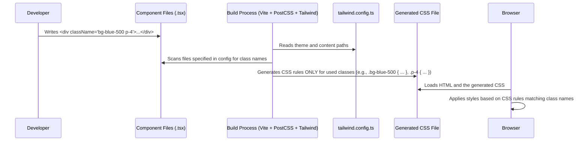

# Chapter 3: Tailwind CSS Styling

Welcome back! In [Chapter 2: Custom Page Components](02_custom_page_components_.md), we saw how pages like our homepage (`Index.tsx`) are assembled from smaller, dedicated component blocks like `<Header />` and `<Hero />`. But how do we make these blocks actually *look* good? How do we control their colors, spacing, size, and layout?

**What's the Goal?**

Imagine you have the basic structure of your webpage, like a plain text document. Now you want to format it: make headings bold, change text colors, add spacing between paragraphs, and arrange elements side-by-side. How do you apply these styles efficiently and consistently?

This chapter introduces **Tailwind CSS**, the primary tool used in `ai-apple-web-forge` for styling our components. It takes a different approach than traditional CSS.

Think of traditional CSS like mixing paints on a palette *before* you touch the canvas. You define a style rule (like "main-title" means "big, bold, blue text") in a separate CSS file and then apply that name to your HTML element.

Tailwind is more like having a huge collection of tiny, pre-mixed paint swatches (called **utility classes**) right next to your canvas (your HTML/JSX code). You pick the exact swatches you need – `blue`, `bold`, `large-text`, `add-padding` – and apply them directly to the element you want to style.

Let's see how this "utility-first" approach works!

## The Core Idea: Utility Classes

Instead of writing custom CSS rules like this:

```css
/* Traditional CSS (e.g., in styles.css) */
.my-button {
  background-color: blue;
  color: white;
  padding: 10px 20px;
  border-radius: 5px;
  font-weight: bold;
}
```

```html
<!-- Applying the custom CSS class -->
<button class="my-button">Click Me</button>
```

With Tailwind, you apply **utility classes** directly in your HTML or JSX markup. Each class controls *one specific CSS property*.

```jsx
// Styling directly with Tailwind utility classes in JSX

<button className="bg-blue-500 text-white py-2 px-4 rounded font-bold">
  Click Me
</button>
```

**Explanation:**

*   `bg-blue-500`: Sets the background color to a specific shade of blue defined in the Tailwind theme.
*   `text-white`: Sets the text color to white.
*   `py-2`: Adds padding on the vertical (y-axis) axis. (`p`=padding, `y`=top/bottom, `2`=size unit).
*   `px-4`: Adds padding on the horizontal (x-axis) axis. (`p`=padding, `x`=left/right, `4`=size unit).
*   `rounded`: Adds a subtle border radius (rounded corners).
*   `font-bold`: Makes the text bold.

You're essentially describing the style of the element using these small, descriptive class names.

## Using Tailwind in Our Components

Let's look back at a snippet from `src/components/CallToAction.tsx` from the previous chapter, focusing on the `className` attributes:

```jsx
// src/components/CallToAction.tsx (Simplified Snippet)
import React from 'react';
import { Button } from "@/components/ui/button"; // A pre-built button component

const CallToAction = () => {
  return (
    // Apply styles to the container div
    <div className="bg-white py-16 md:py-20 lg:py-24 px-6 text-center border-b border-[#F1F1F1]">
      {/* ... other elements ... */}
      
      {/* The Button component likely accepts Tailwind classes too! */}
      <Button 
        size="lg" 
        className="bg-black hover:bg-zinc-800 text-white rounded-xl font-baloo font-semibold text-lg px-8 py-6"
      >
        <a href="#contact">
          Get in Touch
        </a>
      </Button>
    </div>
  );
};

export default CallToAction;
```

**Explanation:**

*   **Container Div:**
    *   `bg-white`: White background.
    *   `py-16`: Vertical padding (size 16).
    *   `md:py-20`: *On medium-sized screens and larger*, increase vertical padding to size 20 (this is called a responsive prefix).
    *   `lg:py-24`: *On large screens and larger*, increase vertical padding further.
    *   `px-6`: Horizontal padding.
    *   `text-center`: Center-align the text inside.
    *   `border-b`: Add a border only to the bottom.
    *   `border-[#F1F1F1]`: Set the border color to a specific hex value (you can use standard CSS values too!).
*   **Button Component:**
    *   The `<Button>` component (from [shadcn-ui Component Library](04_shadcn_ui_component_library_.md)) is built using Tailwind internally and allows us to pass *additional* Tailwind classes via `className`.
    *   `bg-black`: Black background.
    *   `hover:bg-zinc-800`: On hover, change the background to a shade of zinc (another responsive/state prefix).
    *   `text-white`: White text.
    *   `rounded-xl`: A larger border radius.
    *   `font-baloo`: Use the custom 'Baloo Da 2' font (defined in the config).
    *   `font-semibold`: Semi-bold font weight.
    *   `text-lg`: Larger text size.
    *   `px-8 py-6`: Specific horizontal and vertical padding.

By combining these utility classes, we can build complex styles directly in our component files, making it easy to see how an element is styled just by looking at its markup.

## Configuration: The Painter's Palette (`tailwind.config.ts`)

Where do colors like `blue-500` or fonts like `font-baloo` come from? How does Tailwind know which files to scan for classes? This is handled in the `tailwind.config.ts` file.

Think of this file as defining your project's specific design system or "palette".

```typescript
// tailwind.config.ts (Simplified Snippet)
import type { Config } from "tailwindcss";

export default {
  // Tell Tailwind where to look for class names
  content: [
    "./pages/**/*.{ts,tsx}", // Look in pages folder
    "./components/**/*.{ts,tsx}", // Look in components folder
    "./src/**/*.{ts,tsx}", // Look in src folder generally
  ],
  
  // Define the overall theme (colors, fonts, spacing, etc.)
  theme: {
    // Add custom settings or override defaults
    extend: {
      // Define custom colors
      colors: {
        // Example: Access using `bg-primary`, `text-primary`
        primary: 'hsl(var(--primary))', 
        // ... other custom colors like border, input, card, etc.
      },
      // Define custom fonts
      fontFamily: {
        // Access using `font-comfortaa`
        'comfortaa': ['Comfortaa', 'sans-serif'], 
        // Access using `font-baloo`
        'baloo': ['Baloo Da 2', 'sans-serif'],
      },
      // Define custom background gradients
      backgroundImage: {
         // Access using `bg-gradient-text`
        'gradient-text': 'linear-gradient(90deg, #D1A2FF 0%, #007AFF 100%)',
      },
      // ... other extensions for things like animations (keyframes)
    },
  },
  // Add plugins for extra features (like animations)
  plugins: [require("tailwindcss-animate")],
} satisfies Config;
```

**Explanation:**

1.  **`content`:** An array of file paths. Tailwind scans these files to find all the utility classes you've used. This is crucial for optimization.
2.  **`theme`:** This is where the design system lives.
3.  **`theme.extend`:** This section allows you to *add* your own custom values or override Tailwind's defaults without losing the standard utilities.
    *   `colors`: Define custom color names (like `primary`, `secondary`). These often use CSS variables (`var(--primary)`) which might be defined elsewhere (e.g., in `src/index.css`) for theming (like dark/light mode).
    *   `fontFamily`: Define custom font stacks.
    *   `backgroundImage`: Define custom gradients or image URLs.
    *   Other sections like `spacing`, `borderRadius`, `keyframes` allow for further customization.
4.  **`plugins`:** Tailwind can be extended with plugins that add new utility classes or features (like `tailwindcss-animate` used here for animations).

This configuration file is the central place to manage the visual identity of your application.

## How It Works Under the Hood

You might wonder: if we use hundreds of utility classes, doesn't that make our CSS file huge? Tailwind is clever about this!

1.  **Scanning:** During the development or build process (managed by tools like [Vite Build Tool & Dev Server](08_vite_build_tool___dev_server_.md)), Tailwind, often working with another tool called PostCSS (configured in `postcss.config.js`), reads your `tailwind.config.ts` file.
2.  **Finding Classes:** It scans all the files listed in the `content` array (`.tsx`, `.html`, etc.). It looks specifically for sequences of characters that match the pattern of Tailwind classes (like `bg-blue-500`, `text-center`, `md:py-20`).
3.  **Generating CSS:** Tailwind then generates a CSS file that includes *only* the styles for the classes you *actually used* in your project, plus some base styles and any custom CSS you might have.
4.  **Optimization:** This means that even though Tailwind offers thousands of potential utility classes, your final CSS bundle sent to the user's browser remains small and optimized because it only contains the styles needed for your specific application.

**The Setup Files:**

*   **`tailwind.config.ts`:** Defines *what* classes are available (theme, custom extensions) and *where* to look for them (`content`).
*   **`postcss.config.js`:** Tells build tools *how* to integrate Tailwind into the CSS processing pipeline.

    ```javascript
    // postcss.config.js
    export default {
      plugins: {
        tailwindcss: {}, // Enable the Tailwind CSS plugin
        autoprefixer: {}, // Adds browser vendor prefixes (like -webkit-)
      },
    }
    ```
*   **`src/index.css`:** This is typically where you include Tailwind's core layers using directives.

    ```css
    /* src/index.css */
    
    /* Inject Tailwind's base styles (resetting browser defaults) */
    @tailwind base; 
    
    /* Inject Tailwind's component classes (for pre-built components if any) */
    @tailwind components; 
    
    /* Inject Tailwind's utility classes (the ones you use in `className`) */
    @tailwind utilities; 
    
    /* You can add global styles or define CSS variables here too */
    body {
      /* Example global style */
      font-family: theme('fontFamily.baloo'); /* Use theme font */
    }
    /* Example CSS variables for theming (used in tailwind.config.ts) */
    :root {
     --background: 0 0% 100%; /* Light mode background */
     /* ... other variables ... */
    }
    .dark {
     --background: 240 10% 3.9%; /* Dark mode background */
     /* ... other variables ... */
    }
    ```

**Build Process Flow:**



This build process ensures that you get the developer convenience of utility classes without sacrificing performance for the end-user.

## Tailwind and Other Tools

You'll notice Tailwind classes being used everywhere:

*   In our [Custom Page Components](02_custom_page_components_.md).
*   Inside components from the [shadcn-ui Component Library](04_shadcn_ui_component_library_.md), which is built *on top* of Tailwind.
*   Often combined using the [`cn` Utility Function](05__cn__utility_function_.md) to conditionally apply or merge classes.

It forms the foundation of the styling system in this project.

## Conclusion

You've now learned the basics of **Tailwind CSS**, the utility-first framework that powers the styling in `ai-apple-web-forge`:

*   Styles are applied using **utility classes** directly in the HTML/JSX (`className="bg-blue-500 text-white"`).
*   Each class controls a single CSS property, making styles declarative and co-located with the markup.
*   The **`tailwind.config.ts`** file defines the project's theme (colors, fonts, spacing) and tells Tailwind where to find used classes.
*   During the build process, Tailwind generates an **optimized CSS file** containing only the styles actually used.

This approach allows for rapid development, consistent styling, and maintains good performance. While it might seem verbose at first, developers often find it speeds up their workflow significantly once they get used to the utility class names.

Now that we understand how to apply basic styles with Tailwind, how can we leverage pre-built components that already use these styles? Let's explore a popular component library built with Tailwind in the next chapter.

Ready to see some ready-made building blocks? Let's move on to [Chapter 4: shadcn-ui Component Library](04_shadcn_ui_component_library_.md)!

---

Generated by [AI Codebase Knowledge Builder](https://github.com/The-Pocket/Tutorial-Codebase-Knowledge)