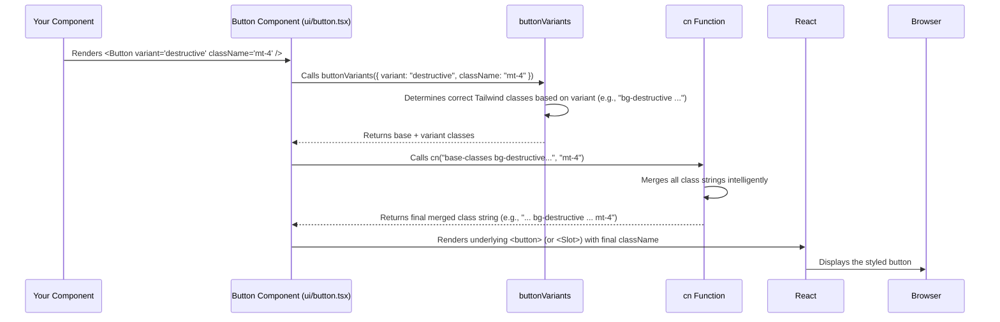

# Chapter 4: shadcn-ui Component Library

Welcome back! In [Chapter 3: Tailwind CSS Styling](03_tailwind_css_styling_.md), we learned how to style our web components using Tailwind's utility classes, applying styles like `bg-blue-500` directly in our code. This is great for custom styling, but what about common UI elements like buttons, menus, dialog boxes, or cards? Do we have to build each one from scratch every time using only basic HTML tags and Tailwind classes? That sounds like a lot of repetitive work!

**What's the Goal?**

Imagine you're building something with LEGOs. You could try to make *everything* from the tiniest 1x1 bricks, but it would be much faster and easier if you had some pre-made pieces like wheels, doors, and windows.

**shadcn-ui** is like having a high-quality LEGO set specifically designed for building web interfaces. It provides a collection of pre-built, reusable UI components (the "windows" and "doors" for our website) that already look good and work well. Our goal is to understand what shadcn-ui is and how to use these pre-built components to quickly assemble parts of our user interface, like adding a standard button to our page.

## What is shadcn-ui?

shadcn-ui is a collection of popular user interface elements that have been pre-built for us. Think of things like:

*   `Button`: Clickable buttons.
*   `Card`: Containers for content with a distinct border/background.
*   `Dialog`: Pop-up windows for messages or forms.
*   `Input`: Form input fields.
*   `Tooltip`: Small hints that appear on hover.
*   `Tabs`: Tabbed navigation sections.
*   And many more!

**Key Features:**

1.  **Built with Tailwind CSS:** These components are styled using the same [Tailwind CSS Styling](03_tailwind_css_styling_.md) utility classes we learned about. This means they fit right into our project's look and feel and are easy to customize further using Tailwind.
2.  **Based on Radix UI:** Under the hood, shadcn-ui uses another library called Radix UI for the core functionality and accessibility features. Radix provides solid, unstyled building blocks (like the logic for how a dropdown menu opens and closes), and shadcn-ui adds the Tailwind styling on top. This ensures the components are accessible to users with disabilities (e.g., keyboard navigation works correctly).
3.  **You Own the Code:** This is unique! Unlike typical libraries you install from `npm` as a hidden package, shadcn-ui provides a command-line tool to *copy* the component's source code directly into your project (usually into `src/components/ui/`). This means you have full control over the code and can modify it however you need.
4.  **Reusable & Consistent:** Using these components helps ensure your website has a consistent look and feel across different pages, as you're reusing the same building blocks.

It's not a component *library* in the traditional sense, but rather a collection of well-crafted components you can pick and choose from, adding their code directly to your project.

## How to Use shadcn-ui Components

Using a shadcn-ui component is very similar to using the [Custom Page Components](02_custom_page_components_.md) we saw earlier. Once the component's code has been added to your project (typically in `src/components/ui/`), you just import it and use it in your JSX.

Let's add a simple button. Assuming the `Button` component code exists in `src/components/ui/button.tsx`:

```jsx
// Inside one of your component files (e.g., src/components/CallToAction.tsx)

// 1. Import the Button component
import { Button } from "@/components/ui/button"; 
// The "@" symbol is often a shortcut configured to point to the "src" directory.
// So, "@/components/ui/button" is the same as "src/components/ui/button.tsx".

const MyComponent = () => {
  return (
    <div>
      <p>Ready to get started?</p>
      {/* 2. Use the Button component like an HTML tag */}
      <Button 
        variant="destructive" // Use a pre-defined style variant
        size="lg" // Use a pre-defined size
        className="mt-4 font-bold" // Add *extra* Tailwind classes
        onClick={() => alert('Button Clicked!')} // Add standard button behavior
      >
        Click Me! 
      </Button>
    </div>
  );
};

export default MyComponent;
```

**Explanation:**

1.  **Import:** We import the specific component (`Button`) from its location within our project's `src/components/ui/` directory.
2.  **Usage:** We use `<Button>` just like any other React component or HTML tag.
3.  **Props:** We can pass special properties (props) to customize it:
    *   `variant="destructive"`: shadcn-ui components often come with predefined style variations. Here, "destructive" might make the button red, indicating a potentially dangerous action. Other variants like "outline" or "ghost" might exist.
    *   `size="lg"`: Similarly, predefined sizes like "sm", "default", or "lg" are common.
    *   `className="mt-4 font-bold"`: We can still add our own [Tailwind CSS Styling](03_tailwind_css_styling_.md) classes to tweak the appearance further (like adding margin-top `mt-4` or making the text bold `font-bold`). These classes often get merged with the component's internal classes using the [`cn` Utility Function](05__cn__utility_function_.md), which we'll cover next!
    *   `onClick={...}`: We can pass standard event handlers like `onClick` just like a regular HTML `<button>`.

This gives us a nicely styled, accessible button without having to write all the underlying HTML and CSS ourselves.

Remember the `CallToAction.tsx` component from Chapter 3? It uses the shadcn-ui `Button`:

```jsx
// src/components/CallToAction.tsx (Snippet)
import { Button } from "@/components/ui/button"; 

const CallToAction = () => {
  return (
    <div className="bg-white ... text-center ...">
      {/* ... */}
      <Button 
        size="lg" // Use the large size variant
        // Apply custom Tailwind styles
        className="bg-black hover:bg-zinc-800 text-white rounded-xl font-baloo font-semibold text-lg px-8 py-6"
      >
        <a href="#contact">
          Get in Touch
        </a>
      </Button>
    </div>
  );
};
```

Here, we're using the `lg` size variant and then heavily customizing the look with specific Tailwind classes like `bg-black`, `hover:bg-zinc-800`, `rounded-xl`, etc.

## Examples of Other Components

The project uses many other components from shadcn-ui. You'll find their source code in `src/components/ui/`. Here are a few examples:

*   **Card:** Used to group related content visually.

    ```jsx
    import { Card, CardHeader, CardTitle, CardContent } from "@/components/ui/card";

    <Card className="w-[350px]"> {/* Optional Tailwind class */}
      <CardHeader>
        <CardTitle>Project Title</CardTitle>
      </CardHeader>
      <CardContent>
        <p>Details about the project go here.</p>
      </CardContent>
    </Card>
    ```

*   **Tooltip:** Shows information on hover.

    ```jsx
    import { Tooltip, TooltipContent, TooltipProvider, TooltipTrigger } from "@/components/ui/tooltip";
    import { Button } from "@/components/ui/button";

    // Need TooltipProvider somewhere higher up in the component tree (see App.tsx)
    <TooltipProvider>
      <Tooltip>
        <TooltipTrigger asChild>
          <Button variant="outline">Hover Me</Button>
        </TooltipTrigger>
        <TooltipContent>
          <p>This is a helpful tooltip!</p>
        </TooltipContent>
      </Tooltip>
    </TooltipProvider>
    ```

*   **AlertDialog:** A confirmation pop-up.

    ```jsx
    import {
      AlertDialog, AlertDialogAction, AlertDialogCancel, AlertDialogContent,
      AlertDialogDescription, AlertDialogFooter, AlertDialogHeader,
      AlertDialogTitle, AlertDialogTrigger,
    } from "@/components/ui/alert-dialog";
    import { Button } from "@/components/ui/button";

    <AlertDialog>
      <AlertDialogTrigger asChild>
        <Button variant="outline">Show Dialog</Button>
      </AlertDialogTrigger>
      <AlertDialogContent>
        <AlertDialogHeader>
          <AlertDialogTitle>Are you sure?</AlertDialogTitle>
          <AlertDialogDescription>This action cannot be undone.</AlertDialogDescription>
        </AlertDialogHeader>
        <AlertDialogFooter>
          <AlertDialogCancel>Cancel</AlertDialogCancel>
          <AlertDialogAction>Continue</AlertDialogAction>
        </AlertDialogFooter>
      </AlertDialogContent>
    </AlertDialog>
    ```

You can see how these components provide complex UI patterns with relatively simple usage in your code.

## Under the Hood: How It Works

So, where does the code for `<Button>` actually come from?

1.  **Adding Components:** When setting up the project or adding a new component, a developer would typically run a command like `npx shadcn-ui@latest add button`.
2.  **Copying Code:** This command fetches the source code for the `Button` component (which uses Radix UI primitives and Tailwind classes) and copies it into your project, usually creating the file `src/components/ui/button.tsx`. It also adds any necessary dependencies (like Radix UI packages) to your `package.json`.
3.  **Local Code:** Now, `src/components/ui/button.tsx` is just another file in your project. You can modify it if needed!

Let's peek inside a simplified version of `src/components/ui/button.tsx`:

```typescript
// src/components/ui/button.tsx (Simplified)
import * as React from "react"
import { Slot } from "@radix-ui/react-slot" // From Radix UI
import { cva, type VariantProps } from "class-variance-authority" // Helper library

import { cn } from "@/lib/utils" // Our utility function (Chapter 5)

// 1. Define base styles and variants using cva
const buttonVariants = cva(
  "inline-flex items-center justify-center rounded-md ...", // Base Tailwind classes
  {
    variants: { // Define variations
      variant: {
        default: "bg-primary text-primary-foreground hover:bg-primary/90",
        destructive: "bg-destructive ... hover:bg-destructive/90",
        outline: "border border-input ...",
        // ... other variants
      },
      size: {
        default: "h-10 px-4 py-2",
        sm: "h-9 rounded-md px-3",
        lg: "h-11 rounded-md px-8",
        // ... other sizes
      },
    },
    defaultVariants: { // Set the defaults if not specified
      variant: "default",
      size: "default",
    },
  }
)

// Define the props the Button component accepts
export interface ButtonProps extends React.ButtonHTMLAttributes<HTMLButtonElement>,
    VariantProps<typeof buttonVariants> { // Includes variant & size props
  asChild?: boolean // Advanced prop from Radix Slot
}

// 2. Create the actual Button component
const Button = React.forwardRef<HTMLButtonElement, ButtonProps>(
  ({ className, variant, size, asChild = false, ...props }, ref) => {
    const Comp = asChild ? Slot : "button"; // Use Slot for composition if needed
    return (
      // 3. Apply the generated classes + any extra className
      <Comp
        className={cn(buttonVariants({ variant, size, className }))} // Use cn!
        ref={ref}
        {...props} // Pass other props like onClick
      />
    )
  }
)
Button.displayName = "Button"

export { Button, buttonVariants } // Export the component
```

**Explanation:**

1.  **`cva` (Class Variance Authority):** This helper function defines the base Tailwind classes for the button and maps the `variant` and `size` props to specific Tailwind classes. For example, if you pass `variant="destructive"`, it knows to add `bg-destructive ...`.
2.  **Component Definition:** A standard React component (`Button`) is created.
3.  **`cn` Function:** It uses the [`cn` Utility Function](05__cn__utility_function_.md) (which we'll explore next!) to cleverly merge:
    *   The base Tailwind classes from `cva`.
    *   The specific variant/size classes determined by the props (`variant`, `size`).
    *   Any *extra* Tailwind classes passed via the `className` prop from where you *use* the button.
4.  **Radix UI (`Slot`):** Sometimes uses features like `Slot` from Radix UI for advanced composition patterns (allowing the Button to wrap other elements seamlessly). The core accessibility and behaviour often come from other hidden Radix primitives used within these components.

When you use `<Button variant="destructive" className="mt-4" />`:



Essentially, the shadcn-ui component takes your desired variant, size, and custom classes, uses helpers like `cva` and `cn` to figure out the final list of Tailwind classes, and renders a standard HTML element (often powered by Radix UI for behaviour/accessibility) with those styles applied.

## Conclusion

You've now learned about the **shadcn-ui Component Library**, a powerful resource used heavily in `ai-apple-web-forge`.

*   It's a collection of **pre-built UI components** (Buttons, Cards, Dialogs, etc.) styled with [Tailwind CSS Styling](03_tailwind_css_styling_.md).
*   It uses **Radix UI** primitives for core functionality and accessibility.
*   You add components by **copying their source code** into your project (`src/components/ui/`), giving you full ownership.
*   Using these components involves importing them and passing props (like `variant`, `size`) and additional `className` for customization.
*   They help build consistent, accessible, and good-looking UIs quickly.

We saw that the `cn` function plays a key role inside these components for merging Tailwind classes. What exactly is this function, and how else can we use it?

Let's dive deeper into this useful helper in [Chapter 5: `cn` Utility Function](05__cn__utility_function_.md)!

---

Generated by [AI Codebase Knowledge Builder](https://github.com/The-Pocket/Tutorial-Codebase-Knowledge)