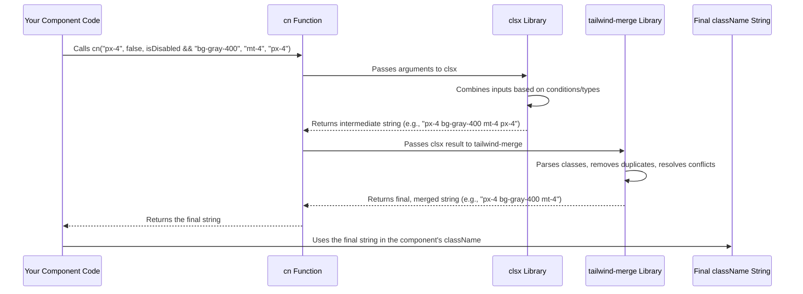

# Chapter 5: `cn` Utility Function

Welcome back! In [Chapter 4: shadcn-ui Component Library](04_shadcn_ui_component_library_.md), we explored how to use pre-built components like `<Button>` and `<Card>` to speed up development. We even peeked inside the `button.tsx` code and saw a mysterious little function called `cn` being used to combine different style classes.

What is this `cn` function, and why is it so important? Let's find out!

**What's the Goal?**

Imagine you're making a button component. You want this button to have some default styles (like padding and rounded corners). But you also want to be able to:

1.  **Change its look based on conditions:** Maybe make it blue if it's the "primary" button, but grey if it's disabled.
2.  **Allow users of your component to add their own extra styles:** Maybe someone using your button wants to add extra margin on top (`mt-4`).

How do you combine all these different style instructions (CSS class names) cleanly and correctly, especially when using [Tailwind CSS Styling](03_tailwind_css_styling_.md)?

This chapter introduces the `cn` utility function, a small but mighty helper found in `src/lib/utils.ts`. Think of it as a **smart label organizer** for your CSS classes. You give it a bunch of style labels (class names), some possibly conditional, and it neatly merges them into one final, clean label string for your HTML element's `className` attribute, ensuring styles apply predictably.

## The Problem: Messy Class Names

Let's try to build that button without `cn`. We'll use [Tailwind CSS Styling](03_tailwind_css_styling_.md) classes.

```jsx
// A simple Button component (WITHOUT cn)

// Define some props the button accepts
interface ButtonProps {
  variant?: 'primary' | 'secondary'; // Optional variant
  isDisabled?: boolean;            // Optional disabled state
  className?: string;               // Optional extra classes from user
  children: React.ReactNode;      // Button text or icon
}

const SimpleButton = ({ variant = 'primary', isDisabled = false, className = '', children }: ButtonProps) => {
  // Base styles for all buttons
  let baseClasses = "px-4 py-2 rounded font-semibold";

  // Add variant styles conditionally
  let variantClasses = '';
  if (variant === 'primary') {
    variantClasses = 'bg-blue-500 text-white';
  } else if (variant === 'secondary') {
    variantClasses = 'bg-gray-200 text-gray-800';
  }

  // Add disabled styles conditionally
  let disabledClasses = '';
  if (isDisabled) {
    // We might override variant colors here!
    disabledClasses = 'opacity-50 cursor-not-allowed bg-gray-400'; 
  }

  // Combine everything + user's classes
  const finalClassName = `${baseClasses} ${variantClasses} ${disabledClasses} ${className}`;
  // Problem: This can have duplicates or conflicting Tailwind classes!
  // E.g., "px-4 ... bg-blue-500 ... bg-gray-400 ..." 

  return (
    <button className={finalClassName} disabled={isDisabled}>
      {children}
    </button>
  );
};

export default SimpleButton;
```

**Explanation:**

We're trying to manually combine strings of class names.

*   We start with `baseClasses`.
*   We add `variantClasses` based on the `variant` prop.
*   We add `disabledClasses` based on the `isDisabled` prop.
*   We add the user-provided `className` prop.

**The Problems:**

1.  **Clunky Logic:** All those `if` statements and string additions make the code harder to read.
2.  **Potential Conflicts:** Look at `disabledClasses`. It sets `bg-gray-400`. If the variant was `primary`, which sets `bg-blue-500`, our final `className` might look like `"px-4 ... bg-blue-500 ... bg-gray-400 ..."`. Which background color wins? With Tailwind, it's usually the *last one* defined in the final CSS file, but that can be unpredictable and hard to debug. We might want the disabled style to reliably override the variant style.
3.  **Duplicates:** If the user passes `className="px-4"` (which is already in `baseClasses`), we'll have `px-4` twice in the final string. While browsers usually handle this okay, it's messy.

We need a smarter way to handle this!

## The Solution: `cn` Utility Function

The `cn` function (short for "class names") solves these problems elegantly. It takes any number of arguments – strings, objects, arrays, even falsy values (like `false` or `null`, which are ignored) – and intelligently merges them into a single string of unique, non-conflicting Tailwind classes.

Let's rewrite our button using `cn`:

```jsx
// The same Button component (WITH cn)
import { cn } from "@/lib/utils"; // Import the hero!

// Props are the same as before
interface ButtonProps {
  variant?: 'primary' | 'secondary';
  isDisabled?: boolean;
  className?: string;
  children: React.ReactNode;
}

const SmartButton = ({ variant = 'primary', isDisabled = false, className = '', children }: ButtonProps) => {
  
  // Use cn to combine everything!
  const finalClassName = cn(
    // Base styles (always applied)
    "px-4 py-2 rounded font-semibold", 
    
    // Conditional variant styles
    { 
      'bg-blue-500 text-white': variant === 'primary' && !isDisabled,
      'bg-gray-200 text-gray-800': variant === 'secondary' && !isDisabled,
    },
    
    // Conditional disabled styles (applied if true)
    isDisabled && 'opacity-50 cursor-not-allowed bg-gray-400', 
    
    // User-provided classes (always included, cn handles merging)
    className 
  );
  // Example Output (primary, not disabled, className="mt-4"):
  // "px-4 py-2 rounded font-semibold bg-blue-500 text-white mt-4"
  // Example Output (primary, disabled, className="mt-4"):
  // "px-4 py-2 rounded font-semibold opacity-50 cursor-not-allowed bg-gray-400 mt-4" 
  // Notice how bg-blue-500 is gone and bg-gray-400 took precedence!

  return (
    <button className={finalClassName} disabled={isDisabled}>
      {children}
    </button>
  );
};

export default SmartButton;
```

**Explanation:**

1.  **Import:** We import `cn` from `src/lib/utils.ts`.
2.  **Combine Arguments:** We pass all our class sources as arguments to `cn()`:
    *   **Strings:** `"px-4 py-2 rounded font-semibold"` is always included.
    *   **Objects:** `{ 'class-name': condition }`. The `'class-name'` is included only if the `condition` is true. We use this for variants, ensuring they only apply if *not* disabled.
    *   **Conditional Strings:** `isDisabled && 'opacity-50 ...'` uses JavaScript's short-circuiting. If `isDisabled` is true, the string `'opacity-50 ...'` is passed to `cn`; otherwise, `false` is passed (and ignored by `cn`).
    *   **Prop:** We simply pass the `className` prop directly.
3.  **Smart Merging:** `cn` takes all these inputs, filters out the falsy ones, combines the strings, and crucially, resolves Tailwind conflicts. In the disabled example, it sees both `bg-blue-500` (from the variant object, which is now false) and `bg-gray-400` (from the disabled condition). Because of how it works internally (using `tailwind-merge`), it correctly prioritizes the intended styles, often favoring classes that appear later in the arguments or that override previous ones (like background colors). It also removes duplicates like `px-4 px-4`.

This code is much cleaner, easier to read, and produces the correct, conflict-free class string automatically.

## How `cn` Works Under the Hood

The `cn` function itself is surprisingly simple. It just combines two other tiny utility libraries:

1.  **`clsx`**: This library is excellent at taking various types of arguments (strings, objects, arrays, booleans) and combining them into a single class string. It handles the conditional logic nicely but doesn't know anything specific about Tailwind CSS conflicts.
2.  **`tailwind-merge`**: This library is specifically designed for Tailwind CSS. It takes a string of class names (like the one produced by `clsx`) and intelligently merges them, removing redundant classes and resolving conflicts based on Tailwind's rules (e.g., `px-4 py-2 px-6` becomes `py-2 px-6`, `bg-red-500 bg-blue-500` becomes `bg-blue-500`).

**The Flow:**

Think of it like organizing sticky notes with style instructions:

1.  **Gather Notes:** You give `cn` a pile of notes (`...inputs`). Some notes have instructions (`"px-4"`), some have conditions (`'bg-blue-500' if primary`), some are blank (`false`).
2.  **`clsx` Sorts:** The first helper (`clsx`) goes through the pile, throws away the blank notes, reads the conditions, and sticks all the valid instructions onto one big sheet of paper, possibly with duplicates or conflicting instructions next to each other. (Input: `"px-4"`, `false`, `'bg-gray-400'`, `"mt-4"`, `"px-4"` -> Output String: `"px-4 bg-gray-400 mt-4 px-4"`)
3.  **`tailwind-merge` Tidies Up:** The second helper (`tailwind-merge`) takes this sheet, reads all the instructions, crosses out duplicates (`px-4`), and resolves conflicts (if there were two `bg-*` classes, it picks the intended winner). It gives you back the final, clean list of instructions. (Input String: `"px-4 bg-gray-400 mt-4 px-4"` -> Output String: `"px-4 bg-gray-400 mt-4"`)

Here's a simplified diagram of that process:



**The Actual Code:**

The code for `cn` in `src/lib/utils.ts` is incredibly short because it just orchestrates these two libraries:

```typescript
// src/lib/utils.ts

// Import the necessary types and functions
import { clsx, type ClassValue } from "clsx" // clsx handles conditional joining
import { twMerge } from "tailwind-merge"    // twMerge handles Tailwind conflicts

// Define the cn function
export function cn(...inputs: ClassValue[]) {
  // 1. Pass all arguments to clsx to get a combined class string
  // 2. Pass the result of clsx to twMerge to resolve conflicts
  return twMerge(clsx(inputs)) 
}

// That's it!
```

**Explanation:**

1.  It imports `clsx` and its type `ClassValue` (which represents the different kinds of things `clsx` can accept).
2.  It imports `twMerge` from `tailwind-merge`.
3.  The `cn` function accepts any number of arguments (`...inputs`) of type `ClassValue`.
4.  It calls `clsx(inputs)` first, which returns a single string like `"base variant disabled extra"`.
5.  It then immediately passes that string into `twMerge()`, which cleans it up according to Tailwind rules and returns the final, optimized string.

This tiny function provides a huge amount of power and convenience when working with Tailwind CSS in React components. You saw it used inside the [shadcn-ui Component Library](04_shadcn_ui_component_library_.md) components for exactly this reason – combining base styles, variant styles, and user-provided `className` props cleanly.

## Conclusion

You've now unlocked the secret of the `cn` utility function!

*   It's a small helper function used for combining CSS class names, especially [Tailwind CSS Styling](03_tailwind_css_styling_.md) utility classes.
*   It makes it easy to apply classes **conditionally** (using objects or `&&`).
*   It **intelligently merges** classes, removing duplicates and resolving conflicts (like multiple background colors), thanks to `clsx` and `tailwind-merge`.
*   It keeps your component code **cleaner and more readable** when dealing with dynamic styles.
*   It's used extensively in libraries like [shadcn-ui Component Library](04_shadcn_ui_component_library_.md) and is a standard tool in many modern React projects using Tailwind.

Now that we have a solid grasp on structuring our app, building components, styling them with Tailwind, using pre-built UI elements, and managing class names effectively, let's add some life to our interface! How can we make elements move and transition smoothly?

Ready to add some motion? Let's explore [Chapter 6: Animation (Framer Motion)](06_animation__framer_motion__.md)!

---

Generated by [AI Codebase Knowledge Builder](https://github.com/The-Pocket/Tutorial-Codebase-Knowledge)