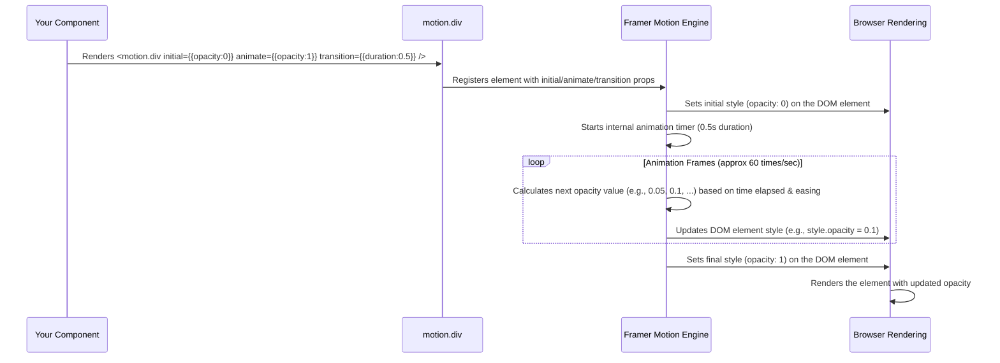

# Chapter 6: Animation (Framer Motion)

Welcome back! In [Chapter 5: `cn` Utility Function](05__cn__utility_function_.md), we learned how the handy `cn` function helps us combine and manage our [Tailwind CSS Styling](03_tailwind_css_styling_.md) classes cleanly, especially when dealing with conditional styles in components like those from the [shadcn-ui Component Library](04_shadcn_ui_component_library_.md). Our app is structured, styled, and organized, but it might feel a bit static. How can we make it feel more alive and engaging?

**What's the Goal?**

Imagine a website where elements just pop into existence instantly. It works, but it's not very exciting. Now imagine a site where sections smoothly fade in as you scroll down, buttons gently pulse when you hover over them, or items animate into place. This subtle movement makes the user experience much more polished and enjoyable.

This chapter introduces **Framer Motion**, a powerful yet friendly React library used in `ai-apple-web-forge` to add these kinds of animations and transitions. Think of Framer Motion as a **choreographer for your web page**. It helps you define *how* elements should move, fade, scale, or react to user interactions, without needing complex manual calculations.

Our goal is to understand the basics of Framer Motion and see how we can use it to:

1.  Make a component react visually when the user hovers over it.
2.  Make a section smoothly animate into view when the user scrolls down to it.

## What is Framer Motion?

Framer Motion is a popular React library specifically designed for creating animations. It allows you to:

*   Animate components when they mount (appear on the screen).
*   Animate components based on changes in their state or props.
*   Create complex sequences and transitions.
*   Animate based on user gestures like hover, tap, or drag.
*   Trigger animations when elements scroll into view.

It uses a **declarative** approach. This means you tell Framer Motion *what* you want the animation to look like (e.g., "start invisible, end visible, take 0.5 seconds") rather than writing step-by-step instructions for *how* to perform the animation frame by frame.

## Key Concepts

Let's break down the core ideas of Framer Motion.

### 1. `motion` Components

To make any standard HTML or SVG element animatable with Framer Motion, you simply prefix it with `motion.`.

*   Want an animatable `div`? Use `<motion.div>`.
*   Want an animatable `button`? Use `<motion.button>`.
*   Want an animatable `h1`? Use `<motion.h1>`.

These `motion` components behave just like their regular HTML counterparts but gain access to special animation props.

```jsx
import { motion } from 'framer-motion';

function MyComponent() {
  return (
    // This div can now be animated using Framer Motion props
    <motion.div>
      Hello, Animation!
    </motion.div>
  );
}
```

**Explanation:**
We import `motion` from the `framer-motion` library. By changing `<div` to `<motion.div`, we've empowered this element with animation capabilities.

### 2. Animation Props (`initial`, `animate`, `transition`)

These props define the core animation:

*   **`initial`**: Defines the state of the component *before* the animation starts. (Where does the actor start?)
*   **`animate`**: Defines the state the component should animate *to*. (Where does the actor end up?)
*   **`transition`**: Defines *how* the animation happens – its duration, delay, easing (the speed curve, e.g., slow start, fast end), or type (like a spring effect). (How does the actor move from start to end?)

```jsx
import { motion } from 'framer-motion';

function FadeInBox() {
  return (
    <motion.div
      initial={{ opacity: 0, scale: 0.8 }} // Start invisible and slightly smaller
      animate={{ opacity: 1, scale: 1 }}   // Animate to fully visible and normal size
      transition={{ duration: 0.5 }}      // Animation takes 0.5 seconds
      style={{ 
        width: 100, height: 100, 
        background: 'lightblue', borderRadius: 10 
      }} 
    />
    // Result: The blue box will fade and scale into view over 0.5 seconds when it first renders.
  );
}
```

**Explanation:**
*   `initial` sets the starting point: `opacity: 0` (completely transparent) and `scale: 0.8` (80% of its size).
*   `animate` sets the destination: `opacity: 1` (fully opaque) and `scale: 1` (100% of its size).
*   `transition` defines the timing: the change happens over `0.5` seconds.

### 3. Interaction Animations (`whileHover`, `whileTap`)

Framer Motion makes it incredibly easy to react to user interactions:

*   **`whileHover`**: Defines the animation state while the mouse cursor is hovering over the element.
*   **`whileTap`**: Defines the animation state while the user is clicking or tapping the element.

```jsx
import { motion } from 'framer-motion';

function HoverButton() {
  return (
    <motion.button
      whileHover={{ scale: 1.1, backgroundColor: "#005AFF" }} // Scale up and change color on hover
      whileTap={{ scale: 0.9 }}    // Scale down slightly while clicking
      transition={{ type: "spring", stiffness: 300 }} // Use a springy effect
      style={{ 
        padding: '10px 20px', background: '#007AFF', color: 'white',
        border: 'none', borderRadius: 5, cursor: 'pointer'
      }}
    >
      Hover Me!
    </motion.button>
    // Result: The button will smoothly scale up and change color when hovered, 
    // and quickly shrink when clicked, using a spring physics animation.
  );
}
```

**Explanation:**
*   `whileHover` tells the button to become slightly larger (`scale: 1.1`) and change its background color when the mouse is over it.
*   `whileTap` tells it to shrink a bit (`scale: 0.9`) during a click.
*   The `transition` prop applies to these hover/tap animations as well, making them springy instead of just linear.

### 4. Scroll Animations (`whileInView`, `viewport`)

This is perfect for animating elements as they enter the screen during scrolling.

*   **`whileInView`**: Defines the state the component should animate to *when it enters the viewport* (the visible area of the browser window). It often works together with `initial`.
*   **`viewport`**: Allows you to customize *how* `whileInView` is triggered. A common setting is `viewport={{ once: true }}`, which means the animation only runs the *first* time the element scrolls into view.

```jsx
import { motion } from 'framer-motion';

function ScrollSection() {
  return (
    <div style={{ height: '150vh', paddingTop: '100vh' }}> {/* Spacer div */}
      <motion.div
        initial={{ opacity: 0, y: 50 }} // Start invisible and 50px down
        whileInView={{ opacity: 1, y: 0 }} // Animate to visible and original position when in view
        transition={{ duration: 0.8, ease: "easeOut" }} // Smooth 0.8s animation
        viewport={{ once: true, amount: 0.3 }} // Trigger once, when 30% is visible
        style={{ height: '50vh', background: 'lightcoral', padding: 20 }}
      >
        <h2>Scroll Down To See Me Animate!</h2>
      </motion.div>
    </div>
    // Result: As you scroll down, when the red section becomes 30% visible,
    // it will fade and slide up into place over 0.8 seconds. It won't animate again if you scroll past and back.
  );
}
```

**Explanation:**
*   `initial` sets the section to be transparent (`opacity: 0`) and shifted down (`y: 50`).
*   `whileInView` defines the target state: fully visible (`opacity: 1`) and back to its original vertical position (`y: 0`).
*   `transition` controls the speed and easing.
*   `viewport={{ once: true, amount: 0.3 }}` ensures the animation runs only the first time the element enters the viewport and triggers when at least 30% (`amount: 0.3`) of the element is visible.

## Using Framer Motion in `ai-apple-web-forge`

Let's look at simplified examples from our project.

**Example 1: Call To Action Button Hover (`src/components/CallToAction.tsx`)**

The "Get in Touch" button uses `whileHover` and `whileTap` for subtle feedback.

```jsx
// Simplified from src/components/CallToAction.tsx
import { motion } from 'framer-motion';
import { Button } from "@/components/ui/button"; // Our shadcn-ui Button

// ... inside the CallToAction component's return statement

  <motion.div // Wrap the Button in motion.div for hover/tap effects
    whileHover={{ scale: 1.03 }} // Slightly enlarge the whole area on hover
    whileTap={{ scale: 0.97 }}   // Slightly shrink on tap
  >
    <Button 
      asChild // Allows Button to compose with the <a> tag inside
      size="lg" 
      className="..." // Tailwind styles
    >
      <a href="#contact">
        Get in Touch
      </a>
    </Button>
  </motion.div>
```

**Explanation:**
We wrap the existing [shadcn-ui Component Library](04_shadcn_ui_component_library_.md) `<Button>` inside a `<motion.div>`. This `motion.div` applies a subtle scale animation on hover and tap, making the button feel more interactive.

**Example 2: Section Fade-in (`src/components/CallToAction.tsx`)**

The entire CallToAction section uses `whileInView` to animate as it appears.

```jsx
// Simplified from src/components/CallToAction.tsx
import { motion } from 'framer-motion';

// ... inside the CallToAction component's return statement

  <motion.div 
    initial={{ opacity: 0, y: 20 }} // Start invisible and slightly down
    whileInView={{ opacity: 1, y: 0 }} // Animate to visible and original position
    transition={{ duration: 0.8, ease: [0.23, 1, 0.32, 1] }} // Custom cubic-bezier easing
    viewport={{ once: true, amount: 0.3 }} // Trigger once when 30% visible
    className="max-w-3xl mx-auto" // Tailwind for layout
  >
    {/* Content of the section goes here */}
    {/* ... Title ... */}
    {/* ... Button (wrapped in motion.div as shown above) ... */}
  </motion.div>
```

**Explanation:**
This applies the fade-and-slide-up animation pattern we saw earlier to the main container `div` of the Call To Action section. The `ease` array defines a custom acceleration curve for a more refined feel.

**Example 3: Staggered Animation with Variants (`src/components/WhatWeDo.tsx`)**

Sometimes you want multiple elements within a container to animate in sequence. Framer Motion's `variants` help organize this.

```jsx
// Simplified from src/components/WhatWeDo.tsx
import React, { useRef } from 'react';
import { motion, useInView } from 'framer-motion';

// 1. Define animation variants (like named animation states)
const containerVariants = {
  hidden: { opacity: 0 },
  visible: { // State when container is visible
    opacity: 1,
    transition: { staggerChildren: 0.2 } // Animate children 0.2s apart
  }
};

const itemVariants = {
  hidden: { opacity: 0, y: 20 }, // Item starts invisible and down
  visible: { opacity: 1, y: 0 } // Item ends visible and in place
};

const WhatWeDo = () => {
  const ref = useRef(null); // Ref to track visibility
  const isInView = useInView(ref, { once: true, amount: 0.3 });

  return (
    <motion.div
      ref={ref} // Attach ref here
      variants={containerVariants} // Use the container variants
      initial="hidden" // Start in the 'hidden' state
      animate={isInView ? "visible" : "hidden"} // Animate to 'visible' when in view
      className="max-w-7xl mx-auto"
    >
      <motion.h2 variants={itemVariants} className="..."> {/* Use item variants */}
        What We Do
      </motion.h2>
      
      {/* ... Other content ... */}
      
      <motion.div variants={itemVariants} className="..."> {/* Use item variants */}
        <h3>Title 1</h3>
        <p>Description 1...</p>
      </motion.div>
      
      <motion.div variants={itemVariants} className="..."> {/* Use item variants */}
        <h3>Title 2</h3>
        <p>Description 2...</p>
      </motion.div>
    </motion.div>
  );
};
```

**Explanation:**
1.  **Variants Defined:** We create objects (`containerVariants`, `itemVariants`) defining named animation states (`hidden`, `visible`). The `containerVariants.visible.transition.staggerChildren` property is key – it tells Framer Motion to apply the animation to direct `motion` children with a delay between each one.
2.  **`useInView` Hook:** We use a React Ref (`useRef`) and Framer Motion's `useInView` hook to detect when the main container scrolls into view.
3.  **Applying Variants:** The container `motion.div` uses `variants={containerVariants}` and controls its state (`initial`, `animate`) based on `isInView`.
4.  **Child Variants:** Each child element that should stagger (`motion.h2`, `motion.div` cards) uses `variants={itemVariants}`. They automatically inherit the `initial` and `animate` state from the parent, and the parent's `staggerChildren` orchestrates their animation timing.

This creates a nice effect where the section fades in, and then the title and cards appear one after the other.

## How It Works Under the Hood

How does `<motion.div initial={{ opacity: 0 }} animate={{ opacity: 1 }}>` actually make something fade in?

1.  **Component Mount:** When the `<motion.div>` is first added to the page (or when its `animate` prop changes), Framer Motion records the `initial` styles (`opacity: 0`) and the target `animate` styles (`opacity: 1`).
2.  **Animation Setup:** It looks at the `transition` prop (or uses defaults) to determine the duration, easing curve, delays, etc.
3.  **Animation Loop:** Framer Motion then uses highly optimized browser mechanisms (like `requestAnimationFrame`) or its own internal animation engine. Frame by frame, it calculates the intermediate style values needed between the `initial` and `animate` states according to the `transition` settings.
4.  **Applying Styles:** In each frame, it applies the calculated style (e.g., `opacity: 0.1`, `opacity: 0.2`, ...) directly to the underlying DOM element (the actual `div` in the browser).
5.  **Completion:** This continues until the element's styles reach the target `animate` state. For interactions like `whileHover`, it animates to the hover state when the mouse enters and automatically animates back to the `animate` state when the mouse leaves.

Here's a simplified view of the process for a fade-in animation:



Framer Motion handles all the complex calculations and browser optimizations, letting you focus on *describing* the animation you want.

## Conclusion

You've now learned the basics of **Framer Motion**, the library that brings `ai-apple-web-forge` to life with smooth animations!

*   It lets you easily animate elements by using **`motion.` components** (like `<motion.div>`).
*   You define animations declaratively using props like **`initial`**, **`animate`**, and **`transition`**.
*   It makes **interaction animations** (`whileHover`, `whileTap`) and **scroll-triggered animations** (`whileInView`) simple to implement.
*   Features like **`variants`** help organize complex animations and sequences (like staggering).
*   It adds a layer of polish and engagement to the user interface, making the website feel more dynamic, as seen in the custom cursor and section load-ins.

We've covered how the app is structured, styled, made interactive, and animated in 2D. But modern web experiences sometimes incorporate 3D elements. How is that achieved?

Ready to enter the third dimension? Let's explore [Chapter 7: 3D Graphics (React Three Fiber)](07_3d_graphics__react_three_fiber_.md)!

---

Generated by [AI Codebase Knowledge Builder](https://github.com/The-Pocket/Tutorial-Codebase-Knowledge)