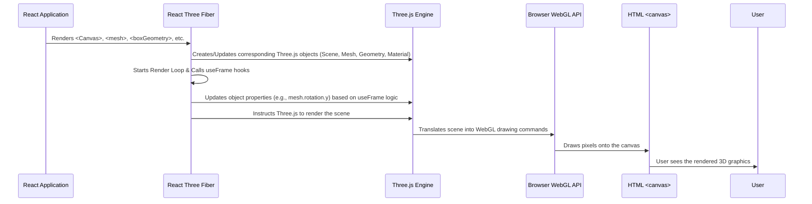

# Chapter 7: 3D Graphics (React Three Fiber)

Welcome back! In [Chapter 6: Animation (Framer Motion)](06_animation__framer_motion_.md), we learned how to bring our website to life with smooth animations and transitions using Framer Motion. We made elements fade in, react to hovering, and animate as we scroll. But what if we want to add a whole new dimension – literally? How can we include interactive 3D shapes and objects directly on our webpage?

**What's the Goal?**

Imagine you want to showcase concepts visually in a more engaging way than just static images or 2D animations. In our "What We Do" section, we have a rotating cube and sphere representing "User Experience" and "Performance". How do we create and display these interactive 3D graphics within our React application?

This chapter introduces **React Three Fiber (R3F)**, a powerful library that lets us build 3D scenes using familiar React concepts. Think of it like having a **mini 3D modeling studio embedded right into your webpage**, where you can create objects, set up lighting, position cameras, and even add animations using React components.

Our goal is to understand the basics of React Three Fiber and see how it's used to render the cool 3D shapes in the "What We Do" section.

## What is React Three Fiber?

At its core, displaying 3D graphics in a web browser usually relies on a technology called **WebGL**. WebGL provides low-level commands to draw triangles, textures, and effects directly using your computer's graphics card (GPU). However, using WebGL directly is quite complex.

This is where **Three.js** comes in. Three.js is a fantastic JavaScript library that makes working with WebGL much easier. It provides ready-to-use objects for cameras, lights, materials (like color and texture), geometries (shapes like cubes, spheres), and manages the complex rendering process. Think of Three.js as the powerful engine of our 3D studio.

**React Three Fiber (R3F)** takes this one step further. It acts as a **React renderer** for Three.js. This means it allows you to:

*   **Describe your 3D scene using React components:** Instead of writing complex Three.js setup code, you use components like `<mesh>`, `<boxGeometry>`, `<ambientLight>`, etc.
*   **Manage your 3D objects within the React component tree:** Your 3D elements become part of your familiar React state and props system.
*   **Leverage the React ecosystem:** Use hooks, context, and other React features seamlessly with your 3D graphics.

R3F essentially provides a bridge, letting you control the powerful Three.js engine using the declarative style of React you already know.

## Key Concepts

Building a 3D scene involves a few core elements, just like setting up a photo shoot:

1.  **The Stage (`<Canvas>`):** This is the main R3F component that sets up the entire 3D environment. It creates the underlying Three.js Scene and Renderer and places an HTML `<canvas>` element on your page where the 3D graphics will be drawn.
2.  **The Actors (`<mesh>`):** These are the actual 3D objects you see. A mesh combines two things:
    *   **Geometry:** The shape of the object (e.g., `<boxGeometry />` for a cube, `<sphereGeometry />` for a sphere).
    *   **Material:** The appearance of the object's surface (e.g., `<meshStandardMaterial color="red" />` for a standard red look).
3.  **The Lighting (`<ambientLight>`, `<directionalLight>`, etc.):** Just like in the real world, without light, you can't see anything! Lights illuminate your actors. Different types of lights create different effects (e.g., soft ambient light vs. harsh directional sunlight).
4.  **The Camera:** This defines your viewpoint into the 3D world. Where are you looking from? What's your field of view? The `<Canvas>` component often sets up a default camera for you, but you can customize it.
5.  **Animation (`useFrame` hook):** R3F provides a hook called `useFrame` that lets you run code on every single frame of the animation loop, perfect for making objects rotate, move, or change over time.

## Using React Three Fiber in `ai-apple-web-forge`

Let's see how these concepts come together in the `WhatWeDo` section. The 3D elements are managed within a dedicated component: `src/components/3d/WhatWeDoScene.tsx`.

**1. Setting up the Stage (`WhatWeDoScene.tsx`)**

This component sets up the main 3D environment.

```typescript
// src/components/3d/WhatWeDoScene.tsx (Simplified)

import React, { Suspense } from 'react';
// The main R3F component to create the 3D canvas
import { Canvas } from '@react-three/fiber'; 
// Helper components from 'drei' (a useful R3F utility library)
import { OrbitControls } from '@react-three/drei'; 
// Our custom 3D object components
import UXCube from './UXCube'; 
import PerformanceSphere from './PerformanceSphere';

const WhatWeDoScene: React.FC = () => {
  return (
    // A regular div to hold the 3D canvas, giving it size
    <div style={{ width: '100%', height: '300px' }}> 
      {/* This is the R3F stage! */}
      <Canvas camera={{ position: [0, 0, 5], fov: 45 }}> 
        {/* Suspense is needed for components that might load async */}
        <Suspense fallback={null}> 
          {/* Lighting: Ambient light illuminates everything softly */}
          <ambientLight intensity={0.5} /> 
          {/* Lighting: Directional light acts like sun/spotlight */}
          <directionalLight position={[10, 10, 10]} intensity={0.8} /> 

          {/* Our 3D Actors (Meshes) */}
          <UXCube position={[-2, 0, 0]} /> 
          <PerformanceSphere position={[2, 0, 0]} /> 

          {/* Controls: Allow user to rotate the view with mouse */}
          <OrbitControls enableZoom={false} enablePan={false} /> 
        </Suspense>
      </Canvas>
    </div>
  );
};

export default WhatWeDoScene;
```

**Explanation:**

*   **`<div style=...>`:** A standard HTML div that defines the area on the page where the 3D scene will appear.
*   **`<Canvas>`:** This is the heart of R3F. It automatically creates the necessary Three.js Scene, Renderer, and a default Camera. We customize the initial camera position and field-of-view (`fov`) here.
*   **`<Suspense>`:** A standard React feature used here because some 3D assets or components might need time to load. `fallback={null}` means show nothing while loading.
*   **`<ambientLight>`, `<directionalLight>`:** These are R3F components that add lights to the scene. Without them, our shapes would be black!
*   **`<UXCube>`, `<PerformanceSphere>`:** These are *our own custom React components* that define the 3D objects. Notice how we use them just like any other React component, passing props like `position`.
*   **`<OrbitControls>`:** A helper component from the `drei` library that automatically adds mouse controls, allowing the user to drag and rotate the view around the objects.

**2. Creating an Actor (`UXCube.tsx`)**

Now let's look inside one of the actor components.

```typescript
// src/components/3d/UXCube.tsx (Simplified)

import React, { useRef } from 'react';
// R3F hook to run code on every animation frame
import { useFrame } from '@react-three/fiber'; 
// Basic Three.js type for a mesh object
import { Mesh } from 'three'; 

const UXCube: React.FC<{ position?: [number, number, number] }> = 
  ({ position = [0, 0, 0] }) => {
  // useRef gives us direct access to the underlying Three.js mesh object
  const meshRef = useRef<Mesh>(null!); 
  
  // This function runs on every frame (e.g., 60 times per second)
  useFrame((state, delta) => { 
    if (!meshRef.current) return; // Safety check
    // Rotate the cube slightly based on time passed (delta)
    meshRef.current.rotation.y += delta * 0.1; 
  });

  return (
    // The core R3F element representing a 3D object
    <mesh 
      ref={meshRef} // Attach the ref here
      position={position} // Set position from props
      // Add event handlers like regular React elements!
      onPointerOver={() => (document.body.style.cursor = 'pointer')}
      onPointerOut={() => (document.body.style.cursor = 'auto')}
    >
      {/* Define the shape (Geometry): A 1.2x1.2x1.2 box */}
      <boxGeometry args={[1.2, 1.2, 1.2]} /> 
      {/* Define the appearance (Material): Standard material, specific color */}
      <meshStandardMaterial color="#A08AFF" roughness={0.6} /> 
    </mesh>
  );
};

export default UXCube;
```

**Explanation:**

*   **`<mesh>`:** This R3F component creates a Three.js Mesh object. It acts as a container for the geometry and material.
*   **`ref={meshRef}`:** We use React's `useRef` hook to get a direct reference to the actual Three.js `Mesh` object created by this component. This allows us to manipulate it directly (like rotating it).
*   **`position={position}`:** We pass the desired position as a prop, just like with standard React components. R3F handles converting the array `[x, y, z]` into the necessary Three.js `Vector3`.
*   **`onPointerOver`, `onPointerOut`:** R3F provides event handlers that work similarly to browser events. Here, we change the mouse cursor when hovering over the cube. (The original code also scaled the cube slightly on hover, which involves modifying `meshRef.current.scale` inside these handlers).
*   **`<boxGeometry args={[1.2, 1.2, 1.2]} />`:** This defines the *shape*. It creates a Three.js `BoxGeometry` with the specified width, height, and depth.
*   **`<meshStandardMaterial color="#A08AFF" roughness={0.6} />`:** This defines the *surface appearance*. It creates a Three.js `MeshStandardMaterial` (a common material type that reacts well to light) with the specified color and roughness.
*   **`useFrame((state, delta) => { ... })`:** This hook is the key to animation. The function provided runs on every frame. `delta` is the time (in seconds) since the last frame. We use `meshRef.current.rotation.y += delta * 0.1;` to slowly increase the rotation around the Y-axis over time, making the cube spin.

The `<PerformanceSphere />` component is structured very similarly, but uses `<sphereGeometry />` instead of `<boxGeometry />` and a different `<meshStandardMaterial>`.

By combining the `<Canvas>` setup with custom components like `<UXCube />` that define meshes and animations, we can build complex 3D scenes declaratively within our React application.

## Under the Hood: From React Components to Pixels

How does `<mesh>` actually become a 3D object on the screen?

1.  **React Rendering:** When React renders your components (like `<WhatWeDoScene />`), R3F intercepts the special 3D components (`<Canvas>`, `<mesh>`, `<boxGeometry>`, etc.).
2.  **R3F Reconciliation:** R3F maintains its own "reconciler" (similar to how React DOM manages HTML elements). When it sees `<mesh>`, it knows it needs to create or update a corresponding `THREE.Mesh` object in the underlying Three.js scene graph.
3.  **Three.js Scene Graph:** R3F translates the component hierarchy into a Three.js scene graph. For example, `<mesh><boxGeometry /><meshStandardMaterial /></mesh>` results in R3F creating `new THREE.BoxGeometry()`, `new THREE.MeshStandardMaterial()`, and `new THREE.Mesh(geometry, material)`, and then adding the mesh to the main `THREE.Scene` object managed by the `<Canvas>`. Props passed to components (like `color` or `position`) are translated into property updates on the corresponding Three.js objects.
4.  **Animation Loop:** The `<Canvas>` component starts a render loop (using `requestAnimationFrame`).
5.  **`useFrame` Execution:** In each iteration of the loop, R3F calls all the functions registered via the `useFrame` hook, allowing you to update object properties (like rotation).
6.  **Three.js Rendering:** After `useFrame` calls, R3F tells the Three.js Renderer to render the current state of the `THREE.Scene` using the specified `THREE.Camera`.
7.  **WebGL Drawing:** Three.js translates the scene graph and material properties into low-level WebGL commands.
8.  **Canvas Output:** WebGL draws the final pixels onto the HTML `<canvas>` element created by the R3F `<Canvas>` component.

Here's a simplified diagram of the flow:



R3F acts as the intelligent manager, translating your declarative React code into imperative commands for the Three.js engine, which then handles the complex task of drawing the 3D graphics via WebGL.

## Conclusion

You've now ventured into the third dimension with **React Three Fiber (R3F)**!

*   R3F lets you build interactive **3D graphics** directly within your React application.
*   It acts as a bridge to the powerful **Three.js** library, allowing you to control it using **React components** (`<Canvas>`, `<mesh>`, `<ambientLight>`, etc.).
*   You describe your 3D scene **declaratively**, just like the rest of your UI.
*   Key elements include the **`<Canvas>`** (the stage), **`<mesh>`** (actors with geometry and material), **lights**, and the **camera**.
*   The **`useFrame` hook** provides an easy way to add animations.
*   This approach is used in `ai-apple-web-forge` to create the engaging 3D shapes in the "What We Do" section.

We've covered building UI components, styling them, adding animation, and even incorporating 3D graphics. But how does all this TypeScript and JSX code actually get turned into the optimized JavaScript, CSS, and HTML files that run in the browser? How does the development server update so quickly when we make changes?

Ready to look under the hood of the build process? Let's move on to [Chapter 8: Vite Build Tool & Dev Server](08_vite_build_tool___dev_server_.md)!

---

Generated by [AI Codebase Knowledge Builder](https://github.com/The-Pocket/Tutorial-Codebase-Knowledge)