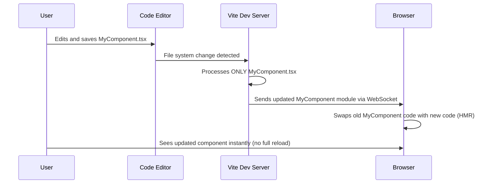

# Chapter 8: Vite Build Tool & Dev Server

Welcome back! In [Chapter 7: 3D Graphics (React Three Fiber)](07_3d_graphics__react_three_fiber_.md), we explored how React Three Fiber allows us to create and display interactive 3D objects right inside our React application, bringing a whole new dimension to our "What We Do" section. We've covered building components, styling them, adding animations, and even 3D!

But have you ever wondered *how* all this modern code we write (like TypeScript, React JSX, fancy CSS) actually turns into the simple HTML, CSS, and JavaScript files that a web browser can understand? And how does the website update almost instantly in your browser when you save a code change during development?

**What's the Goal?**

Imagine our project code is like a collection of raw ingredients and blueprints for a sophisticated machine (our website). We have TypeScript files, React components using JSX syntax, [Tailwind CSS Styling](03_tailwind_css_styling_.md) classes, images, 3D models, etc.

A web browser can't directly use most of these raw ingredients. It needs plain JavaScript, standard CSS, and HTML. We need two things:

1.  **A Workshop (Development Server):** While building the machine, we need a place to quickly assemble parts, see live previews, and instantly test changes without rebuilding the entire thing every time.
2.  **An Assembly Line (Build Tool):** Once we're ready to release the machine to the public, we need an efficient process to assemble all the parts, optimize them for performance and size, and package them into a final, polished product.

This chapter introduces **Vite** (pronounced "veet", like "sweet"), the tool that acts as both our high-speed workshop *and* our efficient assembly line for the `ai-apple-web-forge` project. It's the engine running behind the scenes, making development fast and preparing our code for the real world.

## What is Vite?

Vite is a modern frontend development tool that does two main jobs:

1.  **Provides a Fast Development Server:** When you run `npm run dev`, Vite starts a local web server. This server is incredibly fast because it uses modern browser features (like native ES Modules) to serve your code directly, processing only what's needed on demand. It also enables **Hot Module Replacement (HMR)**, which means when you change code, only that specific piece gets updated in the browser *without* losing your current state (like form inputs or scroll position). It's like changing a tire on a running car!
2.  **Bundles Your Code for Production:** When you run `npm run build`, Vite takes all your project's code (TypeScript, JSX, CSS, assets) and bundles it into a few optimized static files (plain JavaScript, CSS, HTML, images) that are ready to be deployed to a web hosting service. It performs tasks like minification (making code smaller), tree-shaking (removing unused code), and code splitting (breaking code into smaller chunks for faster loading).

Think of Vite as the master technician for our project. It provides the tools and processes to build and test efficiently (`npm run dev`) and then packages everything perfectly for deployment (`npm run build`).

## Key Concepts

Let's break down Vite's roles:

*   **The Workshop (Dev Server):**
    *   Starts instantly with `npm run dev`.
    *   Serves code on demand using native browser features (ESM).
    *   Updates the browser instantly with HMR when you save changes.
    *   Handles processing TypeScript, JSX, CSS, etc., as needed.
*   **The Assembly Line (Build Tool):**
    *   Runs with `npm run build`.
    *   Processes *all* code.
    *   Bundles JavaScript and CSS into optimized files.
    *   Minifies code (removes whitespace, shortens names).
    *   Optimizes assets (like images).
    *   Outputs everything into a `dist` folder, ready for deployment.

## How We Use Vite

We interact with Vite mainly through commands defined in our project's `package.json` file.

```json
// package.json (Relevant Scripts Section)

"scripts": {
  // Starts Vite's development server
  "dev": "vite", 

  // Tells Vite to build the project for production
  "build": "tsc && vite build", 

  // Starts a simple server to preview the production build locally
  "preview": "vite preview" 
  // ... other scripts ...
},
```

**Explanation:**

*   **`npm run dev`:** This command executes `vite`. Vite recognizes it's in development mode and starts its fast development server, usually making the site available at `http://localhost:8080`. It watches your files for changes.
*   **`npm run build`:** This command first runs `tsc` (the TypeScript compiler) to check for type errors, and then runs `vite build`. Vite switches to production mode, processes all files, optimizes them, and places the final output in a `dist/` directory.
*   **`npm run preview`:** After running `npm run build`, this command starts a simple local server to serve the contents of the `dist/` folder, allowing you to test the production build before deploying it.

So, during development, you constantly use `npm run dev`. When you're ready to put your website online, you run `npm run build`.

## Under the Hood: The Development Server (`npm run dev`)

Why is `npm run dev` with Vite so fast?

Traditional bundlers (like older versions of Webpack) would bundle *all* your application's code *before* the server could start. If your app was large, this could take a long time.

Vite takes a different approach using **Native ES Modules (ESM)**. Modern browsers can understand `import` and `export` statements directly.

1.  **Server Start:** `npm run dev` starts the Vite server almost instantly. It doesn't bundle everything upfront.
2.  **Browser Request:** When you open `http://localhost:8080`, your browser requests the main `index.html` file.
3.  **Module Request:** The HTML references your main JavaScript entry point (e.g., `src/main.tsx`). The browser sees the `import` statements inside `main.tsx` and requests those modules directly from the Vite server.
4.  **On-Demand Processing:** Vite intercepts these requests. If a requested file needs processing (like a `.tsx` file needing conversion to JavaScript, or a Tailwind CSS class needing generation), Vite transforms it *just in time* and serves it to the browser.
5.  **Browser Execution:** The browser receives plain JavaScript modules and executes them.

This on-demand approach means Vite only processes the code currently needed by the browser, making startup significantly faster, especially for large projects.

**Hot Module Replacement (HMR):**

When you edit and save a file (e.g., a React component):

1.  **File Change:** Vite detects the change.
2.  **Partial Update:** Vite figures out which part of the code (module) was affected. It processes *only that module* and any closely related ones.
3.  **Push to Browser:** Vite sends the updated module(s) to the browser via a WebSocket connection.
4.  **Browser Patch:** The browser's JavaScript receives the update and swaps out the old code for the new code *without reloading the entire page*.

This allows you to see style changes, component updates, or even logic modifications almost instantly, preserving the application's state.



## Under the Hood: The Build Process (`npm run build`)

While serving modules individually is great for development speed, it's not ideal for production. Having many small files can lead to inefficient loading in browsers due to network request overhead.

When you run `npm run build`, Vite uses a highly optimized bundler (Rollup) under the hood to prepare your code for production:

1.  **Code Analysis:** Vite analyzes your entire codebase, starting from the entry points defined in your `index.html`.
2.  **Transformation:** It converts all TypeScript (`.ts`, `.tsx`) to JavaScript, processes JSX, handles CSS (including Tailwind class generation via PostCSS), and optimizes assets (like images).
3.  **Bundling:** It combines your JavaScript modules into a smaller number of files (bundles).
4.  **Code Splitting:** It intelligently splits the bundles so users only download the code needed for the initial page view, loading other parts later as needed.
5.  **Minification:** It removes unnecessary characters (whitespace, comments) and shortens variable names in JavaScript and CSS to reduce file size.
6.  **Tree Shaking:** It analyzes `import`/`export` statements and removes any code that isn't actually used anywhere in your application.
7.  **Output:** It writes the final, optimized HTML, CSS, JavaScript, and asset files into the `dist` directory.

```mermaid
graph LR
    subgraph Your Project Code
        direction LR
        A[main.tsx] --> B(App.tsx);
        B --> C(HomePage.tsx);
        B --> D(AboutPage.tsx);
        C --> E(Button.tsx);
        F[styles.css];
    end

    subgraph Vite Build Process (`npm run build`)
        direction TB
        G{Vite + Rollup + PostCSS + TSC}
    end

    subgraph Output (`dist` folder)
        direction LR
        H[index.html];
        I[assets/bundle.js];
        J[assets/styles.css];
        K[assets/logo.png];
    end

    A & C & D & E & F --> G;
    G --> H & I & J & K;

    style G fill:#f9f,stroke:#333,stroke-width:2px
```

The `dist` folder contains everything needed to deploy your website – lean, optimized static files.

## Configuration (`vite.config.ts`)

While Vite works well out of the box, you can customize its behavior using the `vite.config.ts` file in your project root.

```typescript
// vite.config.ts (Simplified View)

import { defineConfig } from "vite";
import react from "@vitejs/plugin-react-swc"; // Plugin for React support
import path from "path"; // Node.js utility for handling file paths

export default defineConfig({
  // Server configuration (e.g., port number)
  server: {
    // Allows access from network devices, not just localhost
    host: "::", 
    port: 8080, // Sets the development server port
  },
  
  // Plugins extend Vite's capabilities
  plugins: [
    // Enables React features like JSX conversion and Fast Refresh (HMR)
    react(), 
    // ... (other plugins like lovable-tagger might be here)
  ],
  
  // Resolve configuration (how imports are handled)
  resolve: {
    alias: {
      // Creates a shortcut: '@/' maps to 'src/' directory
      "@": path.resolve(__dirname, "./src"), 
    },
  },
});
```

**Explanation:**

*   **`server`:** Configures the development server (like setting the `port`).
*   **`plugins`:** This is where you add extensions. `plugin-react-swc` is crucial for React projects; it handles JSX transformation and enables React Fast Refresh (Vite's HMR for React). Other plugins can add different features.
*   **`resolve.alias`:** This lets you create shortcuts for import paths. Defining `{"@": path.resolve(__dirname, "./src")}` allows you to write `import MyComponent from '@/components/MyComponent'` instead of `import MyComponent from '../../components/MyComponent'`, which is cleaner and less prone to errors if you move files around. You've seen this `@/` alias used in previous chapters when importing [Custom Page Components](02_custom_page_components_.md) or [shadcn-ui Component Library](04_shadcn_ui_component_library_.md) elements.

Vite's configuration allows you to tailor the development and build process to your project's specific needs.

## Conclusion

Congratulations! You've now peeked into the engine room and assembly line of `ai-apple-web-forge` and learned about **Vite**!

*   Vite acts as both the **fast Development Server** (`npm run dev`) and the **optimizing Build Tool** (`npm run build`).
*   The dev server uses **Native ES Modules** and **Hot Module Replacement (HMR)** for a super-fast development experience.
*   The build process uses **Rollup** to bundle, minify, and optimize your code (TypeScript, JSX, CSS, assets) into static files in the `dist` folder, ready for **production**.
*   Vite is configured via `vite.config.ts`, allowing customization of plugins, aliases, and server options.
*   It's the invisible powerhouse that makes modern web development efficient and enjoyable.

Throughout this tutorial series, we've journeyed from the application's entry point and routing, through building components, styling with Tailwind and shadcn-ui, handling class names, adding animations with Framer Motion, incorporating 3D with React Three Fiber, and finally, understanding the build tool, Vite, that ties it all together. You now have a solid foundational understanding of how the `ai-apple-web-forge` project is built! Keep exploring the code, experimenting, and happy coding!

---

Generated by [AI Codebase Knowledge Builder](https://github.com/The-Pocket/Tutorial-Codebase-Knowledge)